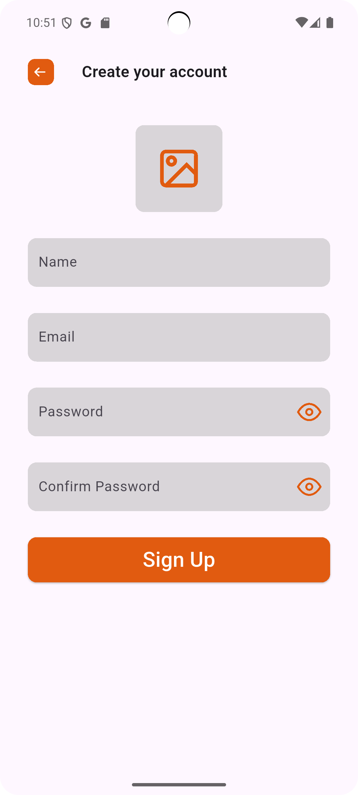
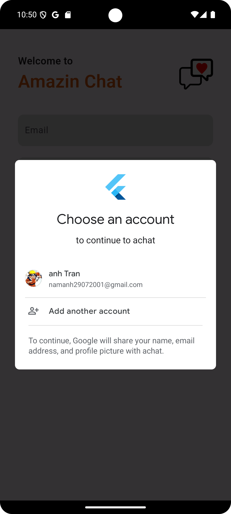
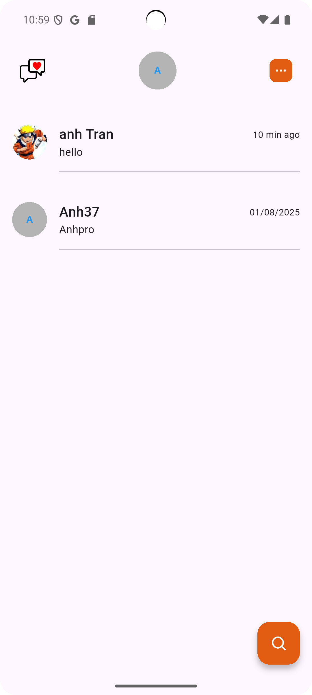
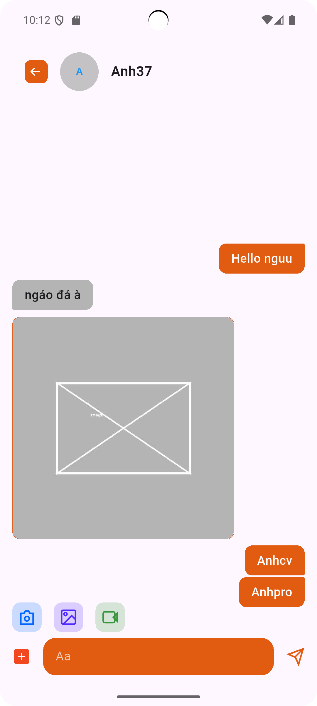
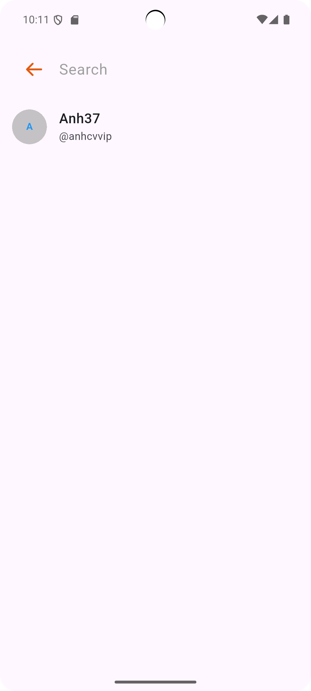
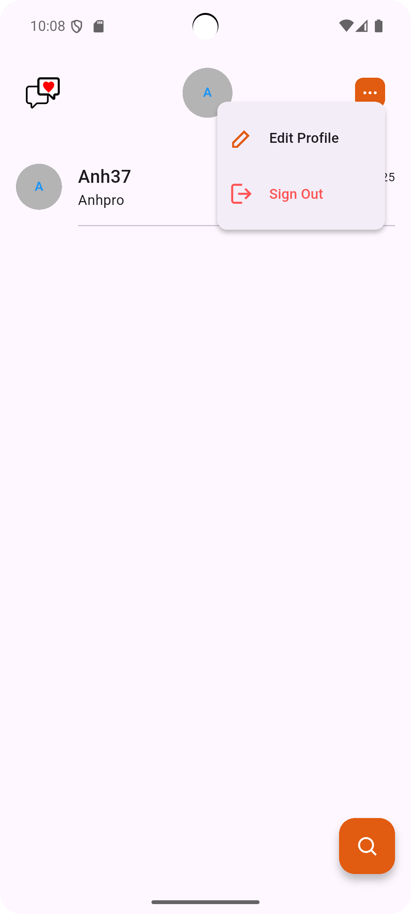
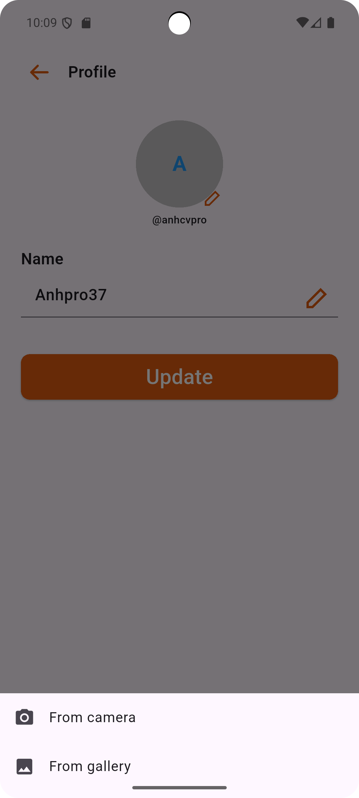
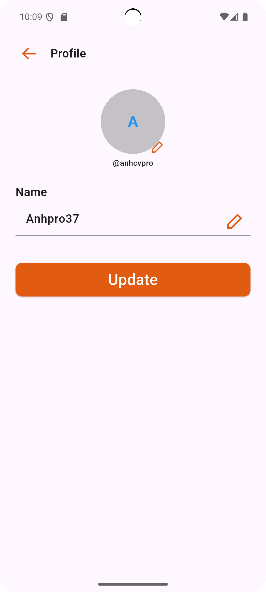

# 🔥 Amazin Chat App

A real-time chat application built with **Flutter** and **Firebase**, supporting user authentication, image/video messaging, and cloud storage.

## 📱 Features

- 🔐 User Authentication:
    - Email & password registration/login
    - Sign in with Google

- 💬 Real-time Messaging:
    - Text message with timestamp
    - Image and video sending
    - Seen/read indicators (optional)

- ☁️ Cloud Storage:
    - Upload media files to Firebase Storage
    - Store chat data in Firestore

- 📐 Architecture:
    - MVVM (Model-View-ViewModel)
    - State management using Provider
    - Firebase Realtime updates with StreamBuilder

- 🧪 Code Quality:
    - Clean Code Principles
    - Organized project structure
    - (Coming Soon) Unit & widget testing

## 🛠️ Tech Stack

| Layer            | Technology                |
|------------------|---------------------------|
| Frontend         | Flutter                   |
| Auth             | Firebase Authentication   |
| Database         | Cloud Firestore           |
| Storage          | Firebase Storage          |
| State Management | Provider                  |
| Architecture     | MVVM                      |

## 📸 Screenshots

- 🆕 Sign Up
  

- 🔑 Sign In
  

- 🔐 Google Sign In
  

- 🏠 Home


- 💬 Room Chat


- 🔎 Search


- ⚙️ Options


- 🖼️ Update Avatar


- 👤 Update Profile



## 🚀 Getting Started

### 🔧 Prerequisites
- Flutter SDK (>= 3.x.x)
- Firebase CLI
- Android Studio 

### ⚙️ Setup

```bash
git clone https://github.com/Anhthn37-NA/amazin-chat-app.git
cd amazin-chat-app
flutter pub get
